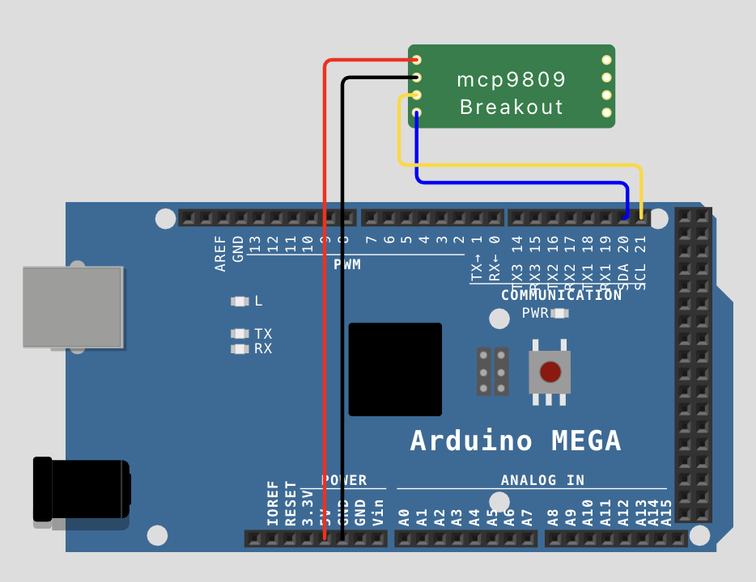

= Wokwi MCP9808

This is a https://docs.wokwi.com/chips-api/getting-started[Wokwi custom chip] implementation for the https://ww1.microchip.com/downloads/aemDocuments/documents/OTH/ProductDocuments/DataSheets/MCP9808-0.5C-Maximum-Accuracy-Digital-Temperature-Sensor-Data-Sheet-DS20005095B.pdf[MCP9808 temperature sensor].  It is modelled after the https://learn.adafruit.com/adafruit-mcp9808-precision-i2c-temperature-sensor-guide[Adafruit breakout board].

== Installation

In a Wokwi project https://docs.wokwi.com/chips-api/getting-started#getting-started[add a new custom chip].  Copy the contents of `mcp9808.chip.json` into the custom chip's json file, and `mcp9808.chip.c` in the c implementation file.

Use the library manager to add a suitable library to the project, e.g. the `Adafruit MCP9808 Library` library.

Wire the custom chip to the microcontroller.  The chip needs `VCC`, `GND`, `SCL` and `SDA` connections.

.Example wiring for Arduino Mega
